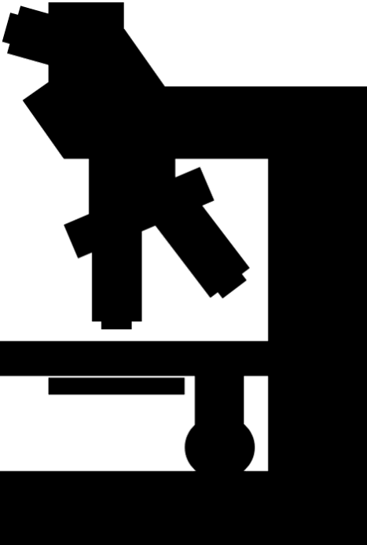

```{r setup, include=FALSE}
knitr::opts_chunk$set(echo = TRUE)

library(tidyverse)
library(lubridate)

load(file = "Rdata/slide_links")

sl <- slide_links %>%
  distinct(osd_dir, .keep_all = TRUE) %>%
  mutate(Cell_Type = case_when(Cell_Type == "Both" ~ "NORM",
                               TRUE ~ Cell_Type)) %>%
  mutate(Cell_Type = factor(Cell_Type, levels = c("NORM", "RBC", "WBC", "PLT"))) %>%
  rename("Cell" = "Cell_Type")
```

```{css, echo=FALSE}
h1 {
  text-align: center;
  font-weight: bold;
}
```

---

### **About**

This site has been created to share [CellaVision](https://www.cellavision.com/en/) slide files with other laboratory professionals and Clinical Laboratory Science educators. These slide files (downloadable via the  within the links at the top of this page) are uploaded into [CellaVision Proficency Software](https://login.cellavision-proficiency-software.com/) and then used for proficiency/competency evaluations and for student teaching/training

I've classified all slide files as:

* Main **Cell** type which the slide focuses
* Corresponding **ASCP BOC Section**, aligning to [ASCP BOC's MLS Content Guideline](https://www.ascp.org/content/board-of-certification/get-credentialed#us-certifications)

Additionally, you will notice a  and or a  that will provide a quick preview to the images contained in the slide file (not all slides have previews)

<br>

---

### **CV Slide Database Stats**

Database last updated `r max(sl$"Date Added")`

**Slide files by Cell type:**

```{r slide_cell_stats, echo=FALSE}
ct <- sl %>%
  group_by(Cell) %>%
  summarise("Total Number of Files" = n()) %>%
  arrange(Cell) %>%
  left_join(sl %>%
              filter(`Date Added` == max(sl$`Date Added`)) %>%
              group_by(Cell) %>%
              summarise("Number Added at Update" = n()), 
            by = "Cell") %>%
  mutate("Number Added at Update" = replace_na(`Number Added at Update`, 0))
knitr::kable(ct)
```

**Slide files by ASCP BOC Section:**

```{r slide_section_stats, echo=FALSE}
st <- sl %>%
  group_by(Section) %>%
  summarise("Total Number of Files" = n()) %>%
  mutate(Section = factor(Section, levels = c("Normal", 
                                              "Anemia - Microcytic",  
                                              "Anemia - Normocytic",
                                              "Anemia - Macrocytic", 
                                              "Anemia - Hemoglobinopathy", 
                                              "Benign - Myeloid", 
                                              "Benign - Lymphoid",
                                              "Neoplasia - Myeloid", 
                                              "Neoplasia - Lymphoid", 
                                              "Hereditary", 
                                              "Thrombocytosis"))) %>%
  arrange(Section) %>%
  left_join(sl %>%
              filter(`Date Added` == max(sl$`Date Added`)) %>%
              group_by(Section) %>%
              summarise("Number Added at Update" = n()), 
            by = "Section") %>%
  mutate("Number Added at Update" = replace_na(`Number Added at Update`, 0))
knitr::kable(st)
```

<br>

---

### **Quick Downloads**

You can download individual slide files by visiting the links in the top navigation bar. Or, you can download all files included in a specific update here (files are compressed, so you will need to unzip the downloads to access the individual slide files):

* [Update 2022-04-07](https://cv-previews.s3.amazonaws.com/zip/update_2022-04-07.zip)
* [[Initial] Update 2022-04-01](https://cv-previews.s3.amazonaws.com/zip/update_2022-04-01.zip)

<br>

---
